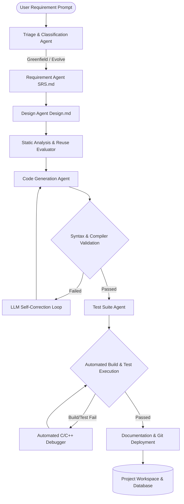

# ⚡ EvoForge — Autonomous Agentic SDLC Engine

[](https://www.python.org/)
[](https://gcc.gnu.org/)
[]()
[]()
[](LICENSE)

**EvoForge** is an autonomous, multi-agentic Software Development Lifecycle (SDLC) framework designed for automated software generation, self-correcting compilation/testing, and incremental codebase evolution.

It automates end-to-end software engineering for **Python**, **C**, and **C++** applications—from requirement parsing and architecture design to source code implementation, test suite generation, Makefile creation, and automated debugging loops.

---

## 🌟 Key Features

- **🌐 Multi-Language Autonomous Generation**: Full lifecycle support for Python (`pytest`), C (`gcc`), and C++ (`g++` / C++17).
- **🤖 Specialized Multi-Agent Crew**:
  - **Triage & Classification Agent**: Autonomously parses requirement prompts and assigns project slugs and execution modes.
  - **Requirement Agent**: Generates structured Software Requirements Specifications (`SRS.md`).
  - **Design Agent**: Generates architecture blueprints (`Design.md`) with Mermaid sequence & class diagrams.
  - **Code Generation Agent**: Implements modular, warning-free source code.
  - **Test Suite Agent**: Writes assertion runners (`test_runner.cpp`) or Pytest suites (`test_*.py`).
  - **Documentation Agent**: Generates user manuals and project READMEs.
  - **Automated C/C++ Debugger**: Detects and fixes header guards, missing include headers (`<limits>`, `<sstream>`, `<cmath>`), Makefile build rules, and C++17 compatibility.
- **🔄 Dual Pipeline Execution Modes**:
  - `run-new`: Greenfield generation from raw natural language prompts.
  - `evolve`: Incremental feature additions, refactoring, and bug fixes on existing projects.
- **🛠️ Self-Correcting Build & Test Loop**: Automatically generates multi-directory Makefiles (`src/`, `tests/`), compiles code, executes unit test suites, and runs self-correction passes if verification fails.
- **🔌 LLM Provider Flexibility**: Runs fully offline via **Ollama** (`qwen2.5`, `llama3`), or online with **Google Gemini** or **OpenAI GPT-4o**.

---

## 🏗️ System Architecture



---

## 📁 Repository Structure

```
EvoForge/
├── agents/
│   └── sdlc_crew.py          # Core CrewAI SDLC Manager & fallback agents
├── database/
│   └── db_manager.py         # SQLite persistence for projects & stage reports
├── tools/
│   ├── build_tools.py        # C/C++ compiler detection, Makefile gen & debugger
│   ├── cli_ui.py             # Rich CLI visual panels, tables & triage badges
│   ├── language_tools.py     # Regex language detection (Python, C, C++) & badges
│   ├── project_tools.py      # Project file I/O & AST parsing
│   ├── requirement_tools.py  # SRS section extraction & requirement classifier
│   ├── static_analysis.py    # AST graph builder & dependency analysis
│   └── impact_tools.py       # Test impact mapping & delta generation
├── projects/                 # Managed software projects (e.g. avl_tree, calc)
├── reports/                  # Stage reports (SRS.md, Design.md, etc.)
├── tests/                    # System unit tests (20 pytest integration tests)
├── main.py                   # CLI entry point
└── requirements.txt          # Python dependencies
```

---

## 🚀 Quick Start

### 1. Prerequisites
- **Python 3.8+**
- **GCC / G++ toolchain & `make`** (for C/C++ projects)
- **Ollama** (optional, for 100% offline local execution)

### 2. Installation

Clone the repository and install dependencies:

```bash
git clone https://github.com/jahnaviyakkala/EvoForge.git
cd EvoForge
python3 -m venv .venv
source .venv/bin/activate  # On Windows: .venv\Scripts\activate
pip install -r requirements.txt
```

### 3. Environment Configuration

Create a `.env` file in the project root:

```env
# LLM Provider: ollama (offline), gemini, or openai
LLM_PROVIDER=ollama

# Ollama Settings (Offline)
OLLAMA_MODEL=qwen2.5:1.5b
OLLAMA_BASE_URL=http://localhost:11434

# Gemini Settings (Optional)
# GEMINI_API_KEY=your_key_here
# GEMINI_MODEL=gemini-1.5-flash

# Disable telemetry
CREWAI_DISABLE_TELEMETRY=true
```

---

## 💻 Usage & CLI Examples

### Greenfield Project Generation (`run-new`)

Generate a complete C++ project from a prompt:

```bash
python main.py run-new --prompt "Create an AVL tree data structure in C++ with insert, delete, search, and inorder traversal"
```

Generate a Python project:

```bash
python main.py run-new --prompt "Create a command line calculator in Python supporting add, subtract, multiply, and divide"
```

### Incremental Code Evolution (`evolve`)

Add new features to an existing project:

```bash
python main.py evolve --name "avl_tree" --prompt "Add pre-order and post-order traversal operations"
```

### Interactive Portfolio & Inspection Mode

Launch the interactive terminal UI to inspect generated projects and reports:

```bash
python main.py
```

---

## 🛠️ Build & Test Generated Projects

All generated projects are stored under `projects/<project_name>/`.

### C/C++ Projects (e.g. `avl_tree`)

```bash
# Build the binary
make -C projects/avl_tree

# Run the interactive application
./projects/avl_tree/avl_tree

# Run automated unit tests
make -C projects/avl_tree test
```

### Python Projects (e.g. `calc_input`)

```bash
# Run the application
python projects/calc_input/main.py

# Run Pytest suite
pytest projects/calc_input/tests
```

---

## 🧪 System Unit Tests

Run the full EvoForge framework test suite to verify system integrity:

```bash
pytest
```

---

## 📄 License

Distributed under the **MIT License**. See `LICENSE` for more information.
