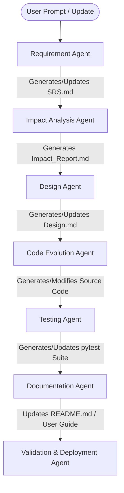

# Architecture Design: Agentic SDLC Framework

This document outlines the architecture, pipeline, and state-management system of the **Agentic AI Framework for Incremental Software Development**.

## 1. System Overview

The Agentic SDLC Framework is designed to automate the Software Development Life Cycle (SDLC) through a cooperative multi-agent system. Instead of regenerating entire codebases upon requirement updates, the system performs **change detection and impact analysis**, making precise edits and updates to existing modules.



---

## 2. Multi-Agent Role Specifications

Each agent in the pipeline is implemented as an independent **CrewAI Agent** with a specialized profile, goal, and task description.

### Phase 1 Agents (Sequential Implementation)

1. **Requirement Agent**
   - **Role:** Lead Software Requirements Analyst
   - **Goal:** Transform raw, informal user requests into structured, unambiguous Software Requirements Specifications (`SRS.md`).
   - **Backstory:** A detail-oriented analyst who excels at capturing user requirements, identifying edge cases, and organizing them into standard IEEE-like functional and non-functional specifications.
   - **Input:** User prompt (raw requirements).
   - **Output:** `SRS.md` in the target project directory.

2. **Design Agent**
   - **Role:** Lead Software Architect
   - **Goal:** Design modular, clean, and robust software architectures based on requirements.
   - **Backstory:** An expert architect specializing in Clean Architecture, Design Patterns, and Modular Systems. Translates functional requirements into object-oriented designs, UML diagrams (represented in Mermaid), and class interfaces.
   - **Input:** `SRS.md` and (optional) previous design state.
   - **Output:** `Design.md` outlining the architecture, class design, and module structures.

3. **Code Evolution (Development) Agent**
   - **Role:** Senior Software Engineer
   - **Goal:** Implement clean, maintainable, and optimized source code based on architecture specifications and impact analyses.
   - **Backstory:** A senior developer with expertise in writing clean Python code adhering to PEP-8 standards. The developer is skilled in both greenfield implementation and modular code modification, ensuring existing code is modified or refactored with minimal disruption.
   - **Input:** `Design.md`, existing code modules (if any), and `Impact_Report.md`.
   - **Output:** Python source files within the project subdirectory.

4. **Testing Agent**
   - **Role:** Senior QA Engineer
   - **Goal:** Write comprehensive unit and integration test suites using `pytest` to validate software requirements and prevent regressions.
   - **Backstory:** A rigorous test engineer dedicated to high code coverage, testing boundary conditions, and writing clear, mock-driven `pytest` assertions.
   - **Input:** Source code files, `SRS.md`, and `Design.md`.
   - **Output:** Test suites (`test_*.py`) verifying functionality.

5. **Documentation Agent**
   - **Role:** Technical Writer
   - **Goal:** Maintain clear, concise, and updated project documentation (README, User Guides, and API Docs).
   - **Backstory:** A technical writer who believes code is only as good as its documentation. Creates user guides and API specifications that are easy to follow.
   - **Input:** Source code files, `SRS.md`, `Design.md`.
   - **Output:** `README.md`, `User_Manual.md`, and API documentation.

### Phase 2 / Evolution Agents (Incremental Development)

6. **Change Detection & Impact Analysis Agent**
   - **Role:** Systems Impact Analyst
   - **Goal:** Compare changes in requirements and analyze the semantic impact on the existing codebase to identify affected files and functions.
   - **Backstory:** An expert in Git diffs, AST parsing, and dependency mapping. Analyzes how a requirement delta propagates through existing classes, modules, and tests, compiling a precise impact footprint.
   - **Input:** Old `SRS.md`, New `SRS.md`, current project source code.
   - **Output:** `Impact_Report.md` detailing affected files, required refactoring, and code reuse guidelines.

---

## 3. Incremental State & Database Schema

To support incremental development without total regeneration, the framework tracks project state in an SQLite database.

```sql
-- Projects table: Tracks managed sub-projects
CREATE TABLE IF NOT EXISTS projects (
    id INTEGER PRIMARY KEY AUTOINCREMENT,
    name TEXT NOT NULL UNIQUE,
    path TEXT NOT NULL,
    created_at TIMESTAMP DEFAULT CURRENT_TIMESTAMP
);

-- File Registry: Tracks hashes of generated files to check for external modifications
CREATE TABLE IF NOT EXISTS file_registry (
    id INTEGER PRIMARY KEY AUTOINCREMENT,
    project_id INTEGER,
    file_path TEXT NOT NULL,
    file_type TEXT NOT NULL, -- 'source', 'test', 'doc', 'spec'
    content_hash TEXT NOT NULL,
    last_modified TIMESTAMP,
    FOREIGN KEY(project_id) REFERENCES projects(id)
);

-- SDLC Runs: Logs runs of the agent pipelines
CREATE TABLE IF NOT EXISTS sdcl_runs (
    id INTEGER PRIMARY KEY AUTOINCREMENT,
    project_id INTEGER,
    run_date TIMESTAMP DEFAULT CURRENT_TIMESTAMP,
    srs_hash TEXT,
    design_hash TEXT,
    status TEXT, -- 'success', 'failed'
    FOREIGN KEY(project_id) REFERENCES projects(id)
);
```

### Flow of Incremental Modification:
1. **Analysis:** The `ImpactAgent` reads new SRS requirements, calculates differences against the old SRS stored in the database/git, and inspects existing files in `file_registry`.
2. **Flagging:** The agent lists which source files and tests are "unchanged", "modified", or "new".
3. **Execution:** The `CodeAgent` is instructed to modify *only* the files marked as "modified" or write "new" files, leaving the rest of the project intact.

---

## 4. Verification and Validation

- **Static Intelligence:** A code-linting and AST-verification tool verifies that the newly modified files compile and preserve existing interface contracts.
- **Dynamic Tests:** `pytest` is invoked on the test suites. If regressions occur, the feedback is passed back to the Code Agent for self-healing.
