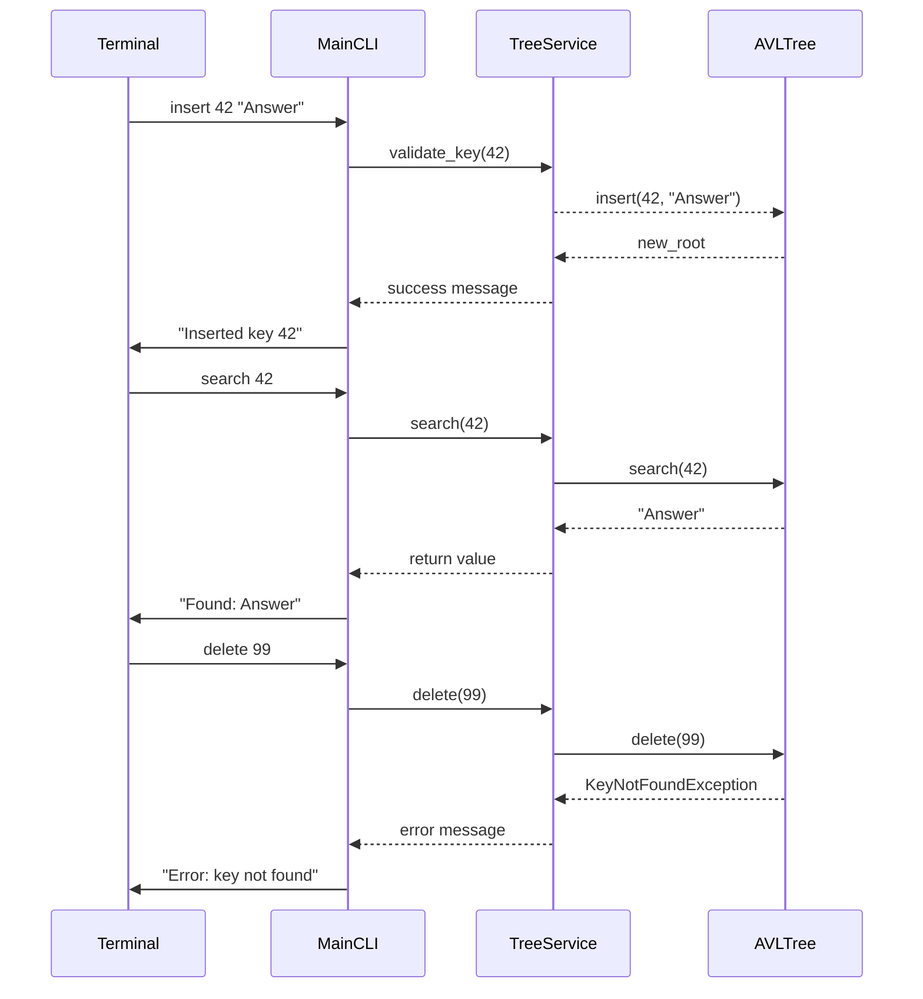

# Design Document – AVL Tree Library (Clean Architecture & SOLID)

## 1. System Architecture Overview

The system is split into three orthogonal layers following Clean Architecture:

| Layer | Responsibility | Key Components |
|-------|-----------------|----------------|
| **Core Domain** | Pure business logic, no external dependencies. Contains the AVL tree data structure and node representation. | `Node`, `AVLTree` |
| **Application Services** | Orchestrates domain objects, enforces validation rules, and exposes use‑case APIs. | `TreeService` |
| **Interface Adapters (CLI)** | Translates user input into service calls and formats output for the terminal. Uses only standard library modules (`argparse`, `sys`). | `MainCLI` |
| **Tests** | Unit tests for each layer, using pytest. No external dependencies beyond the test framework. | Test suites in `tests/` |

The layers communicate via well‑defined interfaces:

```
User (terminal) → MainCLI → TreeService → AVLTree
```

No layer depends on an implementation of another; instead they depend on abstractions (`IAVLTree`, `ITreeRepository`). This satisfies **Dependency Inversion**.

## 2. Module & Class Specifications

### 2.1 Core Domain – `avl/core/node.py`

```python
class Node:
    """
    Represents a node in an AVL tree.

    Attributes
    ----------
    key : Any
        Comparable value used for ordering.
    value : Any
        Payload stored with the key.
    left : Optional[Node]
        Left child (subtree of keys < self.key).
    right : Optional[Node]
        Right child (subtree of keys > self.key).
    height : int
        Height of the node in the tree, used for balancing.

    Methods
    -------
    update_height()
        Recalculate the node's height based on its children.
    balance_factor() -> int
        Return left.height - right.height.
    """
```

### 2.2 Core Domain – `avl/core/tree.py`

```python
class AVLTree:
    """
    Immutable AVL tree implementation.

    Public API
    ----------
    insert(key, value) -> AVLTree
        Return a new tree with the key/value inserted.
    delete(key) -> AVLTree
        Return a new tree with the key removed.
    search(key) -> Optional[Any]
        Retrieve the value associated with *key* or None if absent.
    inorder() -> List[Tuple[key, value]]
        Return all items in ascending key order.
    preorder() -> List[Tuple[key, value]]
        Return all items in pre‑order traversal.
    postorder() -> List[Tuple[key, value]]
        Return all items in post‑order traversal.

    Constraints
    ------------
    * Keys must support the < and > operators.
    * Tree size is capped at MAX_NODES (default 1_000_000) to prevent OOM.
    """

    def __init__(self, root: Optional[Node] = None, size: int = 0):
        ...

    # Internal helpers
    _rotate_left(node: Node) -> Node
    _rotate_right(node: Node) -> Node
    _rebalance(node: Node) -> Node
```

### 2.3 Application Service – `avl/services/tree_service.py`

```python
class TreeService:
    """
    High‑level service that validates input, enforces size limits,
    and delegates to the core AVLTree.

    Attributes
    ----------
    tree : AVLTree

    Methods
    -------
    insert(key: Any, value: Any) -> None
        Validate key type, check size limit, then insert.
    delete(key: Any) -> None
        Validate key existence before deletion.
    search(key: Any) -> Optional[Any]
        Return the stored value or raise KeyError if not found.
    traverse(order: Literal['in', 'pre', 'post']) -> List[Tuple[key, value]]
        Return traversal list according to *order*.

    Exceptions
    ----------
    TreeFullException
        Raised when attempting to insert beyond MAX_NODES.
    InvalidKeyException
        Raised for non‑comparable keys.
    KeyNotFoundException
        Raised by search/delete if key absent.
    """

    def __init__(self, max_nodes: int = 1_000_000):
        self.max_nodes = max_nodes
        self.tree = AVLTree()

    # Public API
    insert(self, key, value) -> None
    delete(self, key) -> None
    search(self, key)
    traverse(self, order)

    # Validation helpers
    _validate_key(key)
```

### 2.4 Interface Adapter – `avl/cli/main_cli.py`

```python
class MainCLI:
    """
    Command‑line interface for interacting with the AVL tree.

    Supported commands:
      - insert <key> <value>
      - delete <key>
      - search <key>
      - traverse <order>   (order ∈ {in, pre, post})
      - exit

    The CLI parses arguments using argparse, calls TreeService,
    and prints results or error messages to stdout/stderr.
    """

    def __init__(self):
        self.service = TreeService()

    def run(self) -> None:
        """
        Main loop: read user input, dispatch to service methods,
        handle exceptions, and print responses.
        """
```

### 2.5 Exceptions – `avl/exceptions.py`

```python
class AVLException(Exception): pass

class TreeFullException(AVLException):
    """Raised when the tree exceeds its maximum allowed size."""

class InvalidKeyException(AVLException):
    """Raised when a key does not support comparison operators."""

class KeyNotFoundException(AVLException):
    """Raised when attempting to delete or search for a non‑existent key."""
```

## 3. Visual Sequence Diagrams



## 4. Data Models & Boundary Validation Rules

### 4.1 Node Model

| Field | Type | Constraints |
|-------|------|-------------|
| `key` | Any | Must implement `<`, `>`; immutable after insertion. |
| `value` | Any | No constraints. |
| `left`, `right` | Optional[Node] | May be None. |
| `height` | int | ≥ 1 for leaf nodes, updated on every mutation. |

### 4.2 AVLTree Constraints

- **Size Limit**: `MAX_NODES = 1_000_000`. Insertion beyond this raises `TreeFullException`.
- **Memory Allocation**: Each node consumes ~48 bytes (approx). The limit ensures < 50 MB usage.
- **Balance Factor**: After every insert/delete, the tree rebalances so that for any node |balance_factor| ≤ 1. Rotations are performed in O(1) time.

### 4.3 Service Validation Rules

| Rule | Description |
|------|-------------|
| `validate_key` | Checks key is comparable; otherwise raises `InvalidKeyException`. |
| `check_size_before_insert` | Ensures current size < MAX_NODES; else raise `TreeFullException`. |
| `ensure_key_exists_for_delete/search` | Raises `KeyNotFoundException` if key absent. |

### 4.4 Error State Models

All errors are represented by custom exception classes inheriting from `AVLException`. The CLI catches these and prints user‑friendly messages while preserving stack traces for debugging.

---

**Note:** All modules expose only the interfaces required by the next layer, keeping each component open for extension but closed for modification (Open/Closed). Each class has a single responsibility: `Node` holds data, `AVLTree` manages structure, `TreeService` enforces business rules, and `MainCLI` handles user interaction. This design satisfies SOLID principles and Clean Architecture while remaining fully synchronized with the functional requirements outlined in `SRS.md`.