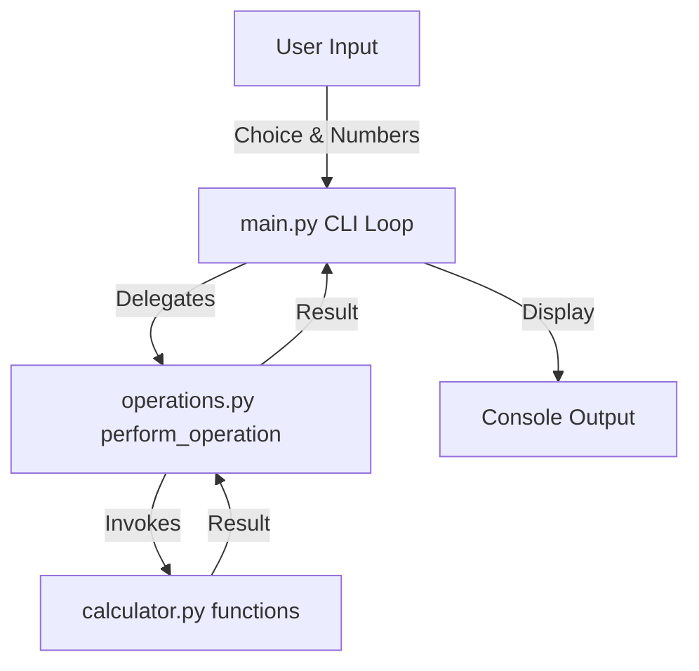

# Design Document: Simple Calculator Utility

## Version: 1.0

### System Architecture Overview
The calculator is designed as a modular command-line utility in Python. It consists of:
1. **Mathematical Core (`calculator.py`)**: Implements basic arithmetic functions.
2. **Operations Controller (`operations.py`)**: Maps operators to mathematical operations and handles computation logic.
3. **User Interface (`main.py`)**: Implements the command-line REPL loop, gathers user input, and handles console printing.

---

### Module Specifications

#### 1. Mathematical Core (`calculator.py`)
Provides pure mathematical functions:
- `add(num1: float, num2: float) -> float`
- `subtract(num1: float, num2: float) -> float`
- `multiply(num1: float, num2: float) -> float`
- `divide(num1: float, num2: float) -> float` (Raises `ValueError` if `num2 == 0`)

#### 2. Operations Controller (`operations.py`)
Mouthpiece between UI and the Core:
- `perform_operation(operation: str, num1: float, num2: float) -> float`

---

### Structural Flow Diagram

