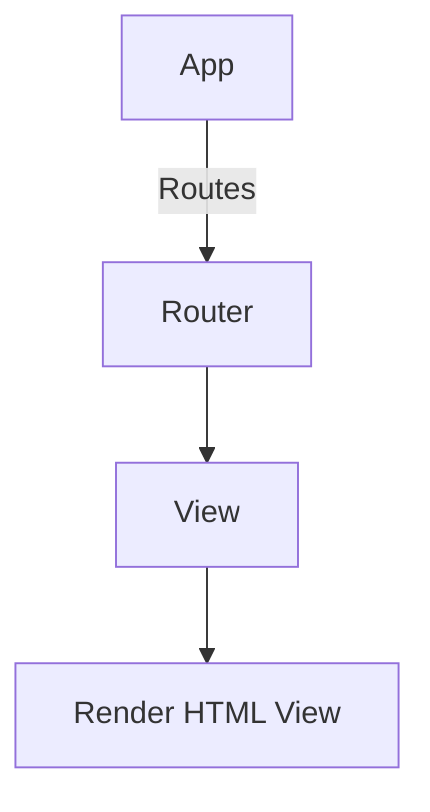
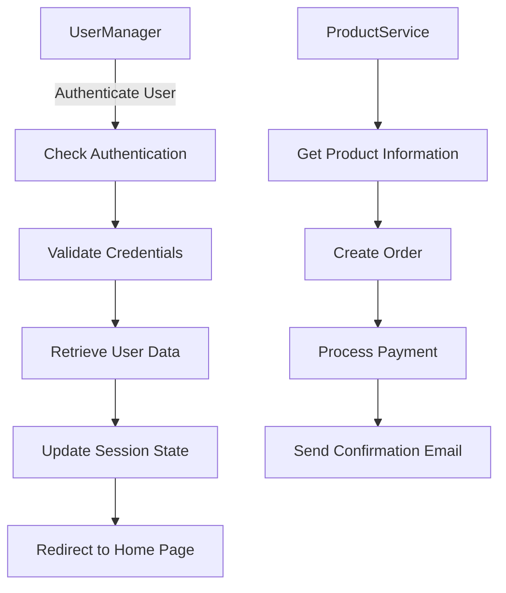
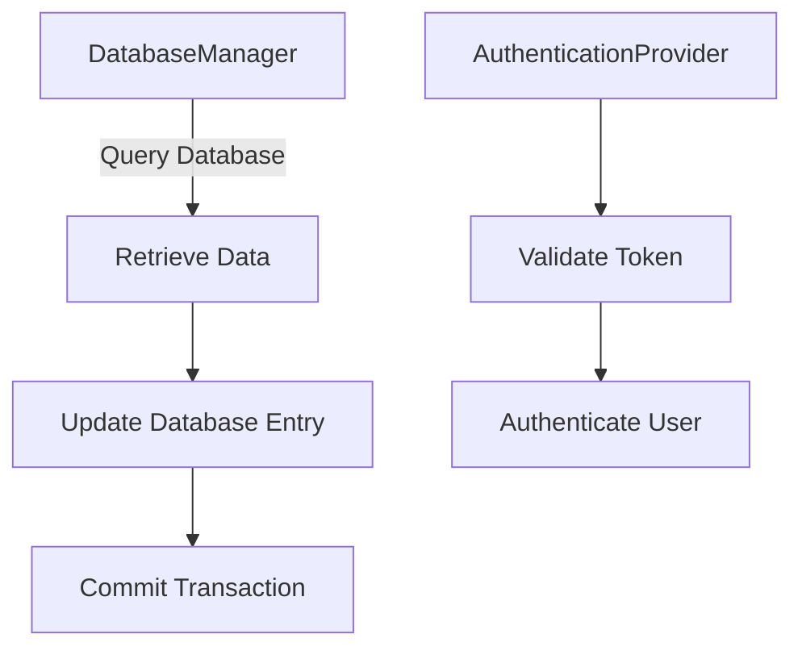
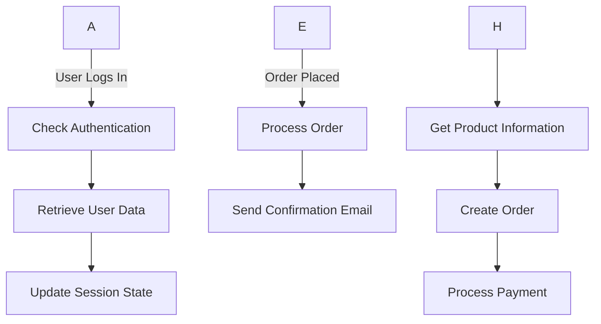

```md

# Design.md

## System Architecture Overview

### Clean Architecture Overview

The system architecture follows the principles of Clean Architecture, ensuring separation of concerns, dependency injection, and a clear boundary between the application layer and infrastructure layers. The architecture is modularized into three main components:

1. **Presentation Layer**: Handles user interactions through web requests.
2. **Application Layer**: Contains business logic and services that interact with the database.
3. **Infrastructure Layer**: Manages external dependencies such as databases, authentication providers, etc.

### Module Specifications

#### Presentation Layer (UI)

- **Module Name**: `ui`
- **Class Names**:
  - `App`: The main entry point of the application.
  - `Router`: Handles routing logic for different pages and routes.
  - `View`: Responsible for rendering HTML views to the user.

#### Application Layer

- **Module Name**: `app`
- **Class Names**:
  - `UserManager`: Manages user authentication and session management.
  - `ProductService`: Provides services related to product operations (e.g., CRUD).
  - `OrderService`: Handles order processing, including payment and delivery.

#### Infrastructure Layer

- **Module Name**: `infrastructure`
- **Class Names**:
  - `DatabaseManager`: Manages database interactions with the ORM.
  - `AuthenticationProvider`: Provides authentication services using JWT tokens.
  - `EmailSender`: Sends email notifications to users.

### Structural & Sequence Flow Diagrams (Mermaid)

#### Presentation Layer



#### Application Layer



#### Infrastructure Layer



#### Sequence Flow Diagrams



### Summary

The system architecture is designed to be modular, clean, and maintainable. The Presentation Layer handles user interactions through web requests, the Application Layer manages business logic and interacts with the database, while the Infrastructure Layer provides external dependencies such as databases and authentication providers.

Thought: I now know the final answer